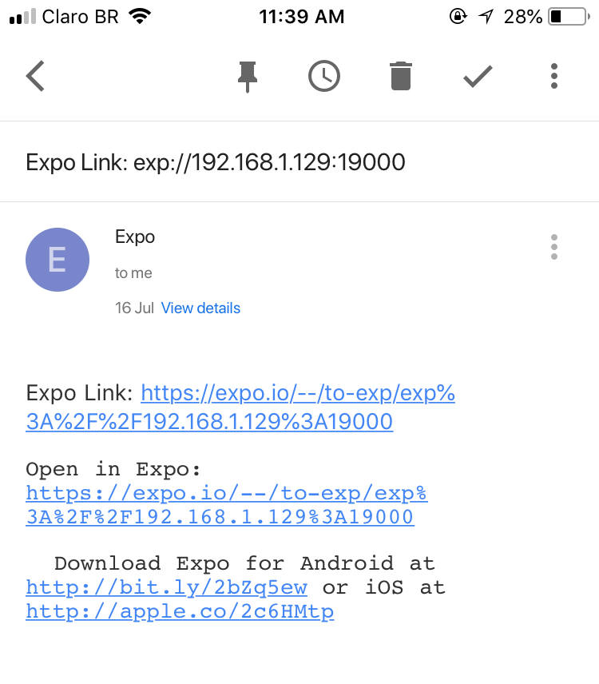

# Running the TriviaGame On Your Device

## Pre-requirements

 - Node v.8.11+ (npm 5.6.0) https://nodejs.org/en/download/

## Get started

Execute the commands below in your terminal:

    $ npm install
    $ npm run start

## Choose a device

You need to download Expo client in your app store:

 - Expo for Android https://play.google.com/store/apps/details?id=host.exp.exponent
 - Expo for iOS https://itunes.apple.com/us/app/expo-client/id982107779

### Android device

Open Expo then click the “Scan QR Code” and Scan the QR code in our terminal. As soon as the QR code got scanned, it’ll automatically load and bundle/compile your project to run it in your device.

### iOS device

On your terminal screen, you will see the following options below:

    › Press a to open Android device or emulator, or i to open iOS emulator.
    › Press s to send the app URL to your phone number or email address
    › Press q to display QR code.
    › Press r to restart packager, or R to restart packager and clear cache.
    › Press d to toggle development mode. (current mode: development)

Press S and type your e-mail. After that, the Expo client will send you an e-mail with your app link. It's necessary to open this e-mail on your phone:

 .

After this step, the Expo Client will open and it’ll automatically load and compile your project to run it in your device.

> I know the iOS instruction is a bit more complicated, but unfortunately due to constant changes in Apple's guidelines and review rules, the Expo team decided to remove the QR Code functionality.

## Future improvements
 - Selection of category and difficulty of the game;
 - Sounds for all actions (buttons, navigation);
 - Store entire score history;